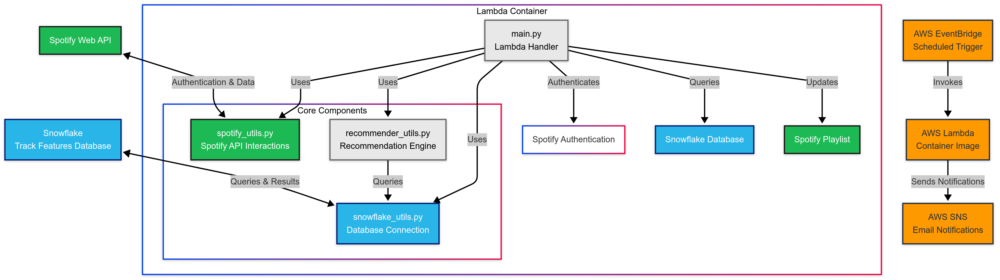

# 🎵 Spotify Recommender System

A serverless AWS Lambda application that automatically updates your Spotify playlists with personalized music recommendations based on your listening history.


## Overview

This system runs as a containerized AWS Lambda function that:

1. Fetches your recently played tracks from Spotify
2. Matches them with a database of song features in Snowflake
3. Generates recommendations using audio feature similarity
4. Updates a designated Spotify playlist with these recommendations
5. Sends you a notification when complete

## Architecture




The system uses:
- **AWS Lambda** (containerized) for the application runtime
- **AWS EventBridge** for scheduled execution
- **AWS SNS** for notifications
- **Snowflake** for storing track features and metadata
- **Spotify Web API** for user data and playlist management

## Project Structure

```
.
├── app/
│   ├── main.py              # Lambda handler
│   ├── spotify_utils.py     # Spotify API interactions
│   ├── recommender_utils.py # Recommendation engine
│   └── snowflake_utils.py   # Database connections
├── Dockerfile               # Container definition
├── requirements.txt         # Python dependencies
├── architecture_diagram.md  # System architecture visualization
└── README.md               
```

## Setup Instructions

### Prerequisites

- AWS account with permissions to create Lambda, EventBridge, and SNS resources
- Spotify Developer account and registered application
- Snowflake account with a database containing track features
- Docker installed locally

### Environment Variables

Configure these in your Lambda environment:

```
SPOTIFY_CLIENT_ID=your_client_id
SPOTIFY_CLIENT_SECRET=your_client_secret
SPOTIFY_REFRESH_TOKEN=your_refresh_token
SPOTIFY_REDIRECT_URI=your_redirect_uri
SPOTIFY_PLAYLIST_ID=your_playlist_id

SNOWFLAKE_ACCOUNT=your_snowflake_account
SNOWFLAKE_USER=your_username
SNOWFLAKE_PASSWORD=your_password
SNOWFLAKE_ROLE=your_role
SNOWFLAKE_DATABASE=your_database
SNOWFLAKE_SCHEMA=your_schema
SNOWFLAKE_WAREHOUSE=your_warehouse

SNS_TOPIC_ARN=arn:aws:sns:region:account-id:topic-name
```

### Deployment Steps

1. **Build the Docker image**:
   ```bash
   docker build -t spotify-recommender .
   ```

2. **Push to Amazon ECR**:
   ```bash
   aws ecr create-repository --repository-name spotify-recommender
   aws ecr get-login-password | docker login --username AWS --password-stdin <your-ecr-url>
   docker tag spotify-recommender:latest <your-ecr-url>/spotify-recommender:latest
   docker push <your-ecr-url>/spotify-recommender:latest
   ```

3. **Create Lambda Function**:
   - Create a new Lambda function using the container image
   - Set memory to at least 256MB and timeout to 30 seconds
   - Configure environment variables

4. **Set up EventBridge**:
   - Create a new rule that runs on a schedule
   - Set the target to your Lambda function

5. **Configure SNS**:
   - Create an SNS topic
   - Add email subscriptions
   - Confirm subscription emails

## How It Works

The recommendation system uses cosine similarity between audio features to find songs similar to what you've recently played. Features include danceability, energy, key, tempo, and more.

## Limitations

- The recommendation database is limited to 10,000 songs
- Static dataset (not continuously updated)
- Requires manual refresh token management for Spotify API

## License

[MIT License](LICENSE)
